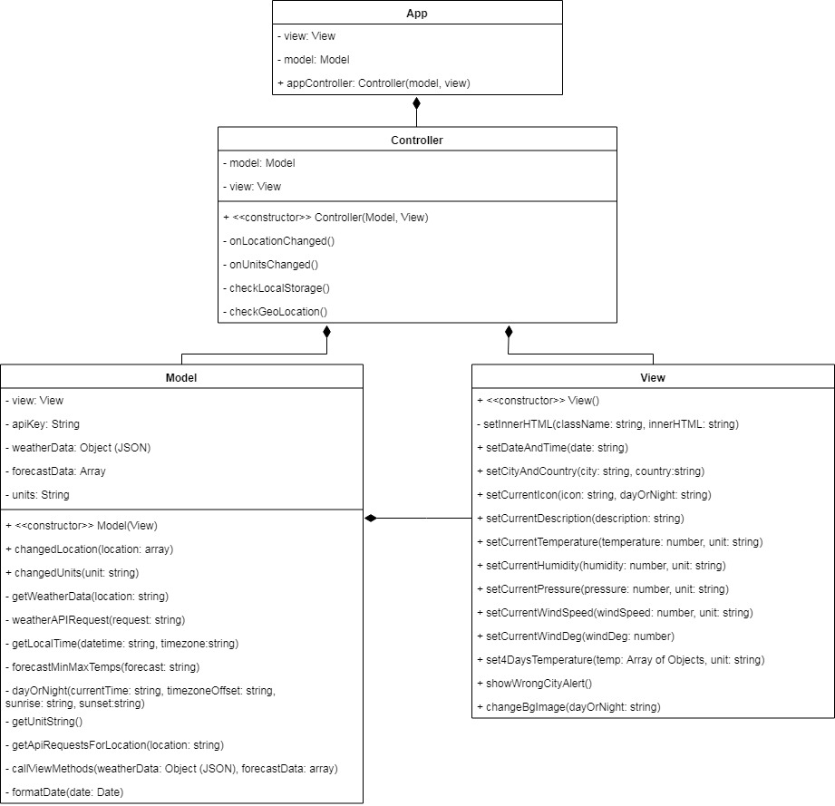

# WeatherApp
A weather forecast app built with vanilla Javascript.

Created as one of the projects during CodersCamp 2019 - a web development bootcamp organized by [CodersCrew](https://coderscrew.pl/) in Wrocław, Poland.

### In order to run our application at your local machine you have to clone this repository firstly
The easiest way to achieve that is to use the command below      

``` git clone https://github.com/anna-postawka/WeatherApp_CodersCamp.git ```

Once you have done that go to the main folder and use the following command which retrieves all dependencies necessary to build our app

``` npm i ```

If the previous commands was executed successfully, the last step you have to take is to type the command below

``` npm start ```

It should take you to a browser with our application running


### Technologies that we used

* HTML 5
* CSS 3
* JS, especially its asynchronous features
* Webpack
* Externals APIs:
  * OpenWeather API
  * Google Places API

### App is built in accordance with MVC architectural pattern



